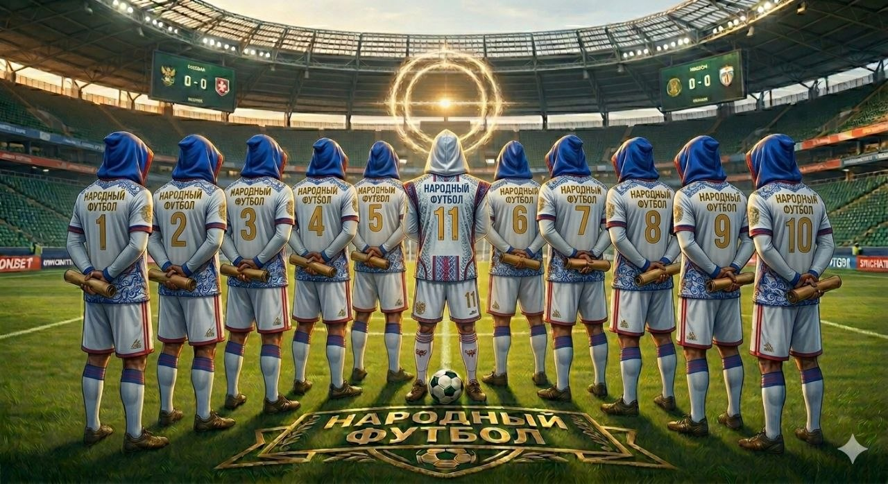

<h1>НАРОДНЫЙ ФУТБОЛ</h1>
<h3>ЭКОСИСТЕМА СПОРТА</h3>

  

<table>
  <tr>
    <td align="center"><a href="captains.md">🛡 СОВЕТ КАПИТАНОВ</a></td>
    <td align="center"><a href="invest.md">💰 ИНВЕСТ-ПЛАН</a></td>
    <td align="center"><a href="smart-field.md">🏟 SMART-ПОЛЕ</a></td>
  </tr>
  <tr>
    <td align="center"><a href="posylka.md">📦 ПОСЫЛКА</a></td>
    <td align="center" colspan="2"><a href="anketa.md">📝 АНКЕТА УЧАСТНИКА</a></td>
  </tr>
</table>

 

<h3>🏗 КОНЦЕПЦИЯ</h3>

<b>"Народный футбол"</b> — это федеральная экосистема, объединяющая инфраструктуру, IT-платформу и социальный лифт для юных талантов.

📍 <b>Локация старта:</b> Ялта, Крым. 
🌍 <b>Масштаб:</b> Вся Россия.

<i>Проект реализуется на принципах прозрачности и высоких технологий.</i>

